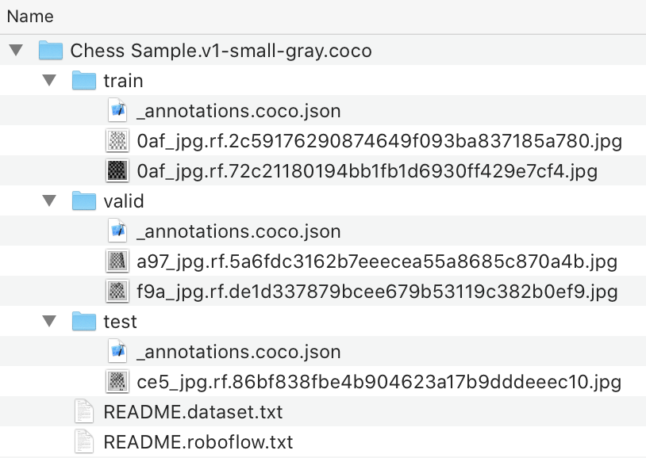

# Roboflow Python Library

This is a helper library to load your [Roboflow](https://roboflow.ai) datasets
into your python scripts and Jupyter notebooks.

## Requirements

This package requires python >=3.6 and a (free)
[Roboflow](https://roboflow.ai) account.

## Installing

#### With PIP
```sh
pip install roboflow
```

#### With Anaconda
```sh
conda install roboflow
```

## Setup

The `roboflow` package works in conjunction with your
[Roboflow](https://roboflow.ai) account.

Simply select "Show Download Code" when exporting a dataset and you will
receive a link that includes your API key. You can use the `roboflow`
package to manage downloading the dataset in various formats.

```python
import roboflow
roboflow.load("https://app.roboflow.ai/ds/####?key=####", "tfrecord")
# dataset is now downloaded and unzipped in your current directory
```

By default the folder is named
```
${dataset-name}.${version-number}-${version-name}.${format}
```
(For example, `Chess Sample.v1-small-gray.coco`).

The file hierarchy is three folders containing the `train`, `valid`, and `test`
data you selected in the Roboflow upload flow (and the format you specified
in `roboflow.load` above). There is also a `README.roboflow.txt` describing the preprocessing and augmentation steps and, optionally, a `README.dataset.txt`
provided by the person who shared the dataset.



## Benefits

This package currently provides two main benefits over downloading and loading
your datasets manually.

1. If you have previously loaded your dataset, it will automatically use the local copy rather than re-downloading.
2. You can dynamically choose the export format at runtime rather than export-time.

## Roadmap

We plan to include more features in the future to allow you (for example,
to let you easily do inference on your trained models).
